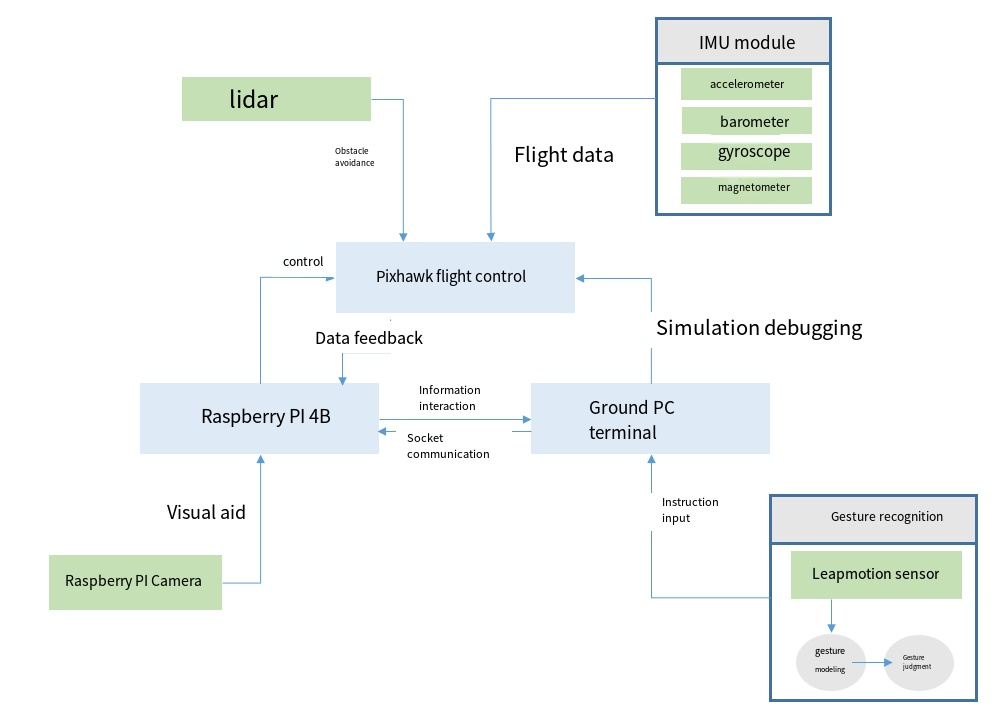
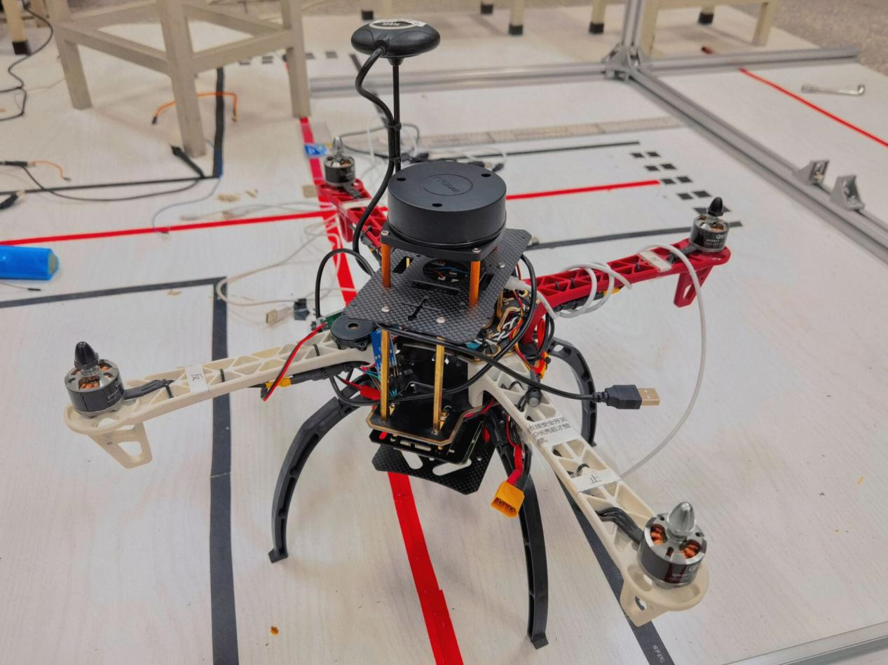
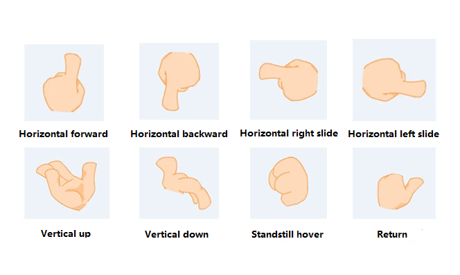
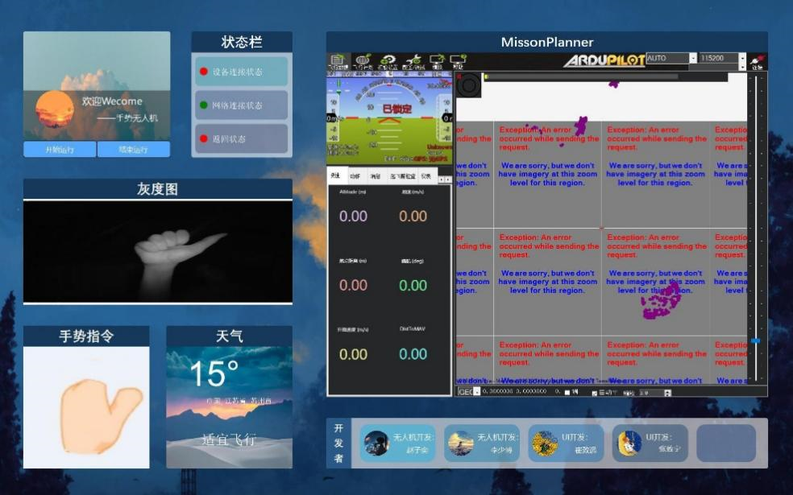

# Gesture_Contro_UAV

### Video

https://user-images.githubusercontent.com/65029895/210196027-d935f3e6-3679-4644-9bf5-9d3de82730e2.mp4

### Collaborators
Thanks to [@ZZY-26-26-25](https://github.com/ZZY-26-26-25), [@berg-jack](https://github.com/berg-jack) and [@NameSpaceQAQ](https://github.com/NameSpaceQAQ) for their joint contribution!

### Introduction
This project provides a leapmotion-based gesture-controlled UAV method and related devices, thus making the remote control end more lightweight and enhancing operability and human-computer interaction, while allowing for the continued development of new command operations with high scalability. This project can solve the problem of low operability and portability of existing UAV control methods, enhance the scalability of UAV control commands, strengthen human-machine interaction, and make it more convenient for UAVs to fly indoors.

We adopt Leapmotion as the gesture recognition device, use Raspberry Pi as the main control center, and communicate directly with the Pixhawk flight control of the UAV through the serial port, develop Leapmotion on the PC side, pre-process the recognized gestures, and then compare them with the preset gestures to get the next command, and transfer them to the Raspberry Pi through socket communication. Raspberry Pi, so as to send commands to the UAV flight control. At the same time, the optical flow module, LIDAR and the map camera are added to facilitate indoor flight height fixing and obstacle avoidance, as well as to view live images.

### Control Logic

The drone is powered by lithium battery, and the Raspberry Pi is powered by UBEC, an external voltage regulator, and then the data is transmitted to the ground PC via socket communication protocol. The Raspberry Pi is equipped with the Dronekit library, which communicates with the flight control board through the MAVLink protocol via serial port for easy development and control; meanwhile, the Pixhawk flight control receives flight information such as speed, altitude, angle and external obstacle information from IMU and LIDAR, and then judges whether to perform obstacle avoidance and other actions according to the parameters.

Secondly, the Leapmotion is developed on the PC side, pre-setting the common gestures and designing the corresponding commands through the code. When the human gesture is recognized by Leapmotion, it is pre-processed first, and if the offset from the previous frame is too small, it is not changed. Then compare with the pre-defined gesture, get the next instruction, transfer the instruction from PC to Raspberry Pi by socket communication, and input the instruction into the corresponding program, so as to successfully send the instruction to the UAV flight control. The control program calls the API in the Dronekit library in order to read the parameters of the drone flight and control the flight status of the drone.

#### UAV

### Development environment
1.  Python2.7 (Leapmotion code for PC)
2.  Python3 (Raspberry Pi side flight control code)
3.  Leapmotion 3.1.3SDK
4.  PyQt5

### File description
1.  ui_control.py file is the pc-side code to run and launch the UI interface.
2.  uav_control_pi.py file is the code of Raspberry Pi side. You need to start the UAV manually first, and then click the "start running" button on the UI interface after the UAV reaches the set height.
3.  gesture.py file is the gesture recognition and PC communication code, after the UI interface is started, click "start running" to start, it needs PC to connect to Leapmotion.

### Development process

#### Raspberry Pi

Raspberry Pi is used to establish a communication relationship with Leapmotion through ssh remote connection tool and socket communication to transfer the commands identified and converted by Leapmotion to Raspberry Pi and process them through the program. Secondly, through the Dronekit library on board, the commands sent and processed by the gesture recognition module are written to the flight control by means of serial communication based on the Mavlink protocol, thus achieving the effect of secondary development and controlling the flight of the UAV.

#### Leapmotion gesture recognition

1.  The design recognizes 8 gestures: horizontal forward, horizontal backward, horizontal right slide, horizontal left slide, vertical up, vertical down, standstill hover and abort return.

2.  Frame data unity: according to the timestamp of the frame, only when the interval between the timestamp of the current frame and the timestamp of the last output action is greater than 100000 microseconds (unit of timestamp), a gesture is output. Realize gesture smoothing, reduce data fluctuation, and cooperate with data communication.
3.  Recognition range: fixed in the range where the distance from the center of the palm to the center of the leapmotion is less than or equal to 250mm with itself as the top angle. Since the Leapmotion detection range is a cone with itself as the top corner, we found in the actual test that the leapmotion control is very sensitive to static gesture recognition, but there is a problem of ineffective recognition of dynamic gestures outside a certain range. In order to ensure the accuracy of dynamic gesture recognition, we use the above range for recognition, beyond the default hover, the final recognition accuracy reached more than 98%.

#### Socket communication
1.  connect PC and Raspberry Pi under the same wireless network, use PC as client side and Raspberry Pi as server side, program the host address as IP of PC side and set the port value to use bind() function to finish the handshake connection, then use send() and accept() functions to realize the data sending and receiving operations.
2.  use the TCP method in sockets.
3.  using TCP_NODELAY in socketsockopt, disabling the Nagle algorithm to ensure that gesture data is sent as soon as it is generated.
4.  choosing the blocking communication method, adding autonomous confirmation after the UAV receives the data, and blocking on the PC side when no feedback is received from the UAV to ensure that a gesture data and the UAV command match.
5.  design the communication data format as fixed-length command "$0n#xx,yy,zz#nnnn$": start and end with $; 0n is used to select the corresponding flight command to ensure the scalability of the command; separated by #; xx,yy,zz is the flight direction vector; nnnn is to select the 4-bit speed for transmission based on the speed data collected by leapmotion tracking that matches the UAV flight speed.
6.  the gesture speed matches the drone speed, and the gesture speed matches 0-500 matches the drone speed of 0-5.
7.  considering the safety of the drone, use try and except structures on the Raspberry Pi side to monitor the socket.send( ) on the drone side in real time to ensure that the drone can return fully automatically when the connection is disconnected.

#### UI interface

User interaction part, we use PyQt and other python libraries to visualize the current location, weather status, real-time gesture recognition information, drone flight line data and other information, and to be able to control some of the functions.

UI interface program as the main process, gesture recognition and socket communication as the child process part. The recognized gesture types and IR camera images are transmitted in real time to the UI part of the parent process using the pipe pipeline. The transmitted information is divided into 3 categories: send a run signal when Leap motion is detected to connect to PC normally, send gesture type and picture when real-time detection is done, and send termination signal when recognition is terminated. It improves the interactivity of the whole system with the user and facilitates the user to know the information of the recognized gestures in real time.

1.  Control section: When it starts to run, a sub-process will be started to run the code of UI interface and leapmotion gesture recognition and communication section at the same time. The click event will be connected to a timed timeout event, the timer will time out once every 0.1 seconds, after the timer timeout, it will use the pipe recv( ) to receive the information from the leap motion part, so as to achieve the effect of "real-time update".
2.  status information: the interface provides three status detection information: device connection status, network connection status and return status. The device connection status indicates that the leap motion hardware is normally connected to the PC, and the status will change to green when the leap motion can be transmitted normally after clicking the start button, and to red when the leap motion part is finished; the network connection status indicates that the PC is connected to the network, and since it needs to use the socket communication in the LAN and use the ip to get The current location weather conditions, so in the UI interface run to get the weather status, determine the network status, normal connection will be shown as a green light; return state indicates that the drone is in the return state, in the leap motion due to the recognition of the return gesture or other reasons to end the operation, the drone will be in the return state, at this time to send the return signal to the main process, the main process detects the signal will return to the state The main process detects the signal and marks the return status as green.
3.  Grayscale map: Show the picture of one of the IR cameras of the leap motion. Receive: flight status logo, PIL.
4.  gesture command information: real-time display of 8 types of gestures detected by leap motion: horizontal forward, horizontal backward, horizontal right slide, horizontal left slide, vertical up, vertical down, stationary hover and abort return.
5.  Weather information: current temperature, geographic location and suitability for flight. Use the IP address query API interface to get the current public IP address, then query the API, get to get the geographic location, unpack, split and encode the obtained respone to get the country, region and city where the IP belongs to. After that, use the obtained address to get the json package of current weather status by get query weather API, then get the required weather status one by one by index, and judge whether the current weather status is suitable for UAV flight.
6.  MissonPlanner: MissonPlanner flight control software interface. MissionPlanner displays the UAV camera shooting screen, and the data interface in the lower left corner gets the flight data of the UAV (such as altitude, altitude, and weather conditions). The MissionPlanner displays the UAV camera footage, the data interface at the bottom left gets the flight data of the UAV (such as altitude, speed, etc.), and the map window at the right shows the geographic location of the UAV.
